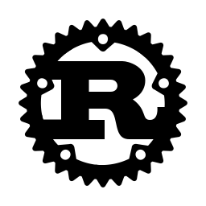

# Welcome to **minipopstar**

  

Creative, Passionate, and Efficient Full-Stack Blockchain developer. Possesses diverse experience of creating multiple highly scalable applications using different tech stacks. Leaded successful transition from MEAN & MERN Stack to Web3 & Cryptocurrency Stack to improve Web3.0 system performance which is the focus and the future of our life, so for now implemented Staking Platform, DEX, Bridge, NFT Marketplaces by using Web3 libraries, Solidity and Rust.
Have worked in all phases of the project life cycle, using a wide variety of tools and frameworks.

  

<h1 align="center"></h1>

## **𝐒𝐤𝐢𝐥𝐥𝐬**

<table>
  <tr>
    <td></td>
    <td></td>
    <td></td>
    <td></td>
    <td></td>
    <td></td>
    <td></td>
    <td></td>
    <td></td>    
    <td></td>
    <td></td>
    <td></td>
  </tr>
  <tr>
    <td></td>
  </tr>
</table>

## **👍 Experienced Blockchain Networks**

<table>
  <tr>
    <td align="center" width="96">
      
       Ethereum
    </td>
    <td align="center" width="96">
      
       Binance
    </td>
    <td align="center" width="96">
      
       Solana
    </td>
    <td align="center" width="96">
      
       Casper
    </td>    
    <td align="center" width="96">
      
       Polkadot
    </td>
    <td align="center" width="96">
      
       Avalanche
    </td>
    <td align="center" width="96">
      
       Polygon
    </td>
  </tr>
  </table>
